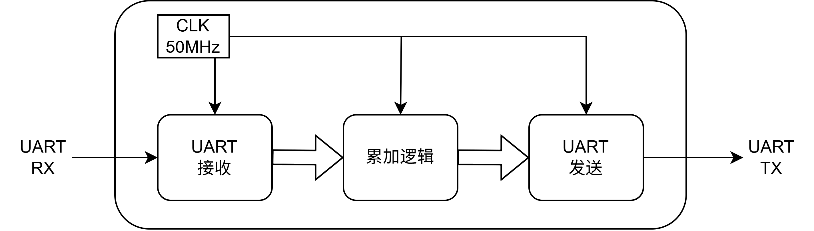
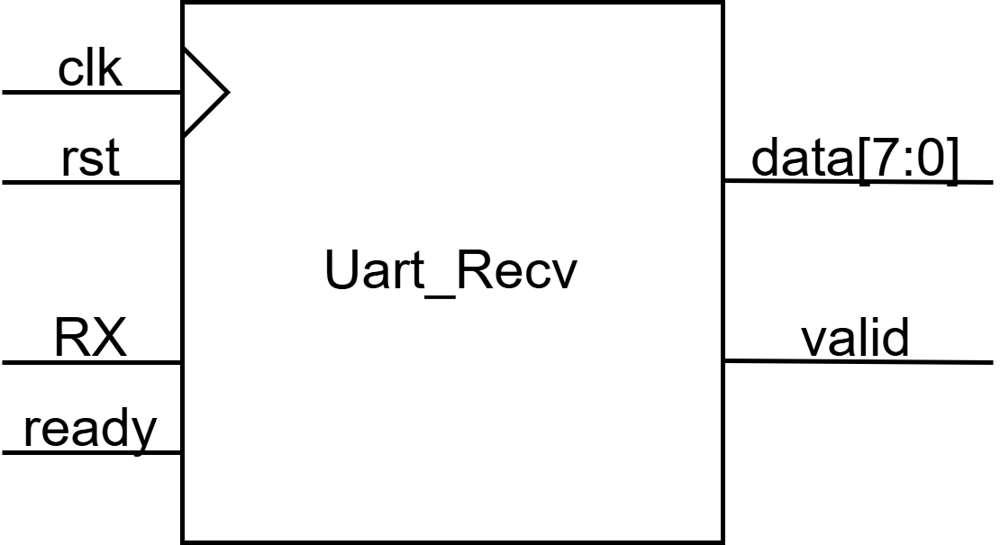
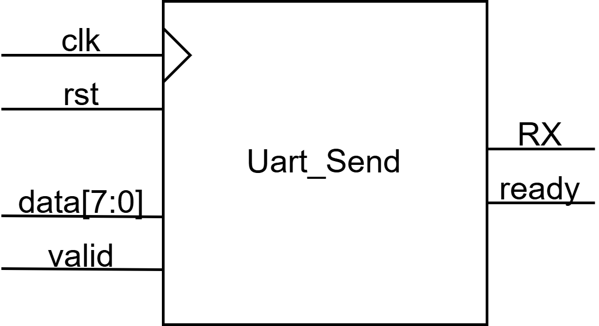

Part-1 UART 通信
===

这一部分的代码位于 [GitHub](https://github.com/TongLeen/SoC-Course-Design/tree/main/Part1)

## 设计内容

上位机发送数据到串口，数据数量不定长。要求电路将得到的数据累加之后，发送回串口，返回到上位机。
串口传输速率不限，串口通信协议不限。

## 接口设计

### UART 配置

使用核心板上自带的USB-COM接口芯片，配置如下
| 配置   | 参数   |
| ------ | ------ |
| 波特率 | 115200 |
| 字长   | 8 bit  |
| 校验位 | 无     |
| 结束位 | 1 bit  |

### 上位机通信协议

由于需要接收不定长的数据用于累加，传输前设计电路需要知道用于累加的数据长度。考虑到这是个简单的累加器，则通信方式无需过于复杂。

认为每个数据均为0~255的整数，且总的数据量不超过255个。则数据长度字段占用1个字节，数据字段每个数据占用1个字节。

| 数据长度 | 数据0  | 数据1  | ... |
| -------- | ------ | ------ | --- |
| 1 Byte   | 1 Byte | 1 Byte | ... |
 
## 逻辑电路设计

电路需要完成以下功能：
1. 从串口接收数据；
2. 解析需要累加的数据长度，计算累加的结果；
3. 将结果从串口发送出去。

这里将电路分为三个主要模块：
1. 串口接收：负责UART协议的数据解析；
2. 串口发送：负责UART协议的数据发送；
3. 累加逻辑控制。

{width="70%"}

### 串口接收

#### 参数计算 {#sec:uart_recv_param}

选取的波特率为115200，系统时钟为50MHz，得到所需的波特率需要进行分频：
$$(5 \times 10^7) / 115200 \approx 434.0277$$
取整数分频为434。

UART接收时，需要对单个bit时长的数据进行多次采样，从而得到信号稳定时的值。对434进行质因数分解：
$$434 = 2 \times 7 \times 31$$
取7作为单个bit的采样点数。综上，每个采样点信号由时钟信号 $2 \times 31 = 62$ 分频产生，每个bit采样7次。

#### 模块接口设计

考虑模块的功能，从RX得到数据，以8bit的并行信号给出。
因此，除时钟信号和复位信号外，需要UART RX信号和数据输出信号。
设计的模块外围接口如下。

{width="60%"}

各信号方向和功能如下表。信号`data`只在`valid`和`ready`信号同时为高电平时传输。

| 引脚  | 方向 | 功能                     |
| ----- | ---- | ------------------------ |
| clk   | in   | 50MHz时钟信号            |
| rst   | in   | 同步复位信号，高电平复位 |
| data  | out  | 数据输出                 |
| valid | out  | 数据输出有效             |
| ready | in   | 数据接收端就绪           |
| RX    | in   | 串口接收信号线           |

#### 模块实现

模块的工作过程如下：
1. 复位后模块处于停止状态，监听RX上的低电位信号；
2. 当RX上出现连续3个采样点都是低电平时，开始接收，进入运行状态；
3. 每隔7个采样点取出一次数据，放入高位进入的9bit移位寄存器；
4. 共取出9bit数据后，停止移位，进入停止状态；
5. 检查最高位，即最后一个数据（结束位），是否为1，如果不是认为数据有误，舍弃；
6. 将数据`valid`信号置位，等待`ready`信号；
7. 当`ready`信号为高电平时，下一个时钟将`valid`信号复位。

### 串口发送

#### 参数计算

在[接收模块的参数计算](#sec:uart_recv_param)这一节中，我们计算得到波特率115200需要对50MHz进行434分频。

#### 模块接口设计

UART发送器的工作是将输入的数据以正确的时序串行发送到TX线上。其外围接口信号如下
{width="60%"}

各信号方向和功能如下。信号`data`只在`valid`和`ready`信号同时为高电平时传输。

| 引脚  | 方向 | 功能                     |
| ----- | ---- | ------------------------ |
| clk   | in   | 50MHz时钟信号            |
| rst   | in   | 同步复位信号，高电平复位 |
| data  | in   | 数据输入                 |
| valid | in   | 数据输入有效             |
| ready | out  | UART发送器就绪           |
| RX    | out  | 串口发送信号线           |

#### 模块实现

模块的工作过程如下：
1. 复位后处于停止状态；
2. 当`valid`信号到来时，如果处于停止状态，给出高电平的`ready`，将`data`上的数据存入内部寄存器，进入运行状态；否则不响应；
3. 将数据与1bit的起始位，1bit结束位进行拼接，得到10bit待发送的比特流；
4. 在分频后的时钟到来时，将最低位发送出去，并整体向右移1位；
5. 完成9次移位后，发送完成，进入停止状态。

### 累加逻辑控制

#### 需要的功能

需要实现不定长度的多Byte数据累加，累加结束后发送出去。其中数据的个数由第一个Byte给出。因此，需要一个累加器已经控制累加个数的状态机。这个控制累加个数的状态机，其累加的个数来自于首个接收的数据。

#### 模块实现

根据上一小节的分析，其工作流程应该是这样的：
1. 得到一个字节的数据，作为累加的个数。此时进入运行状态，同时清空累加器的输出；
2. 此后，每得到一个数据，均放入累加器，并使得剩余数据计数器的值减一；
3. 当接收到最后一个数据时，进入停止状态；
4. 在进入停止状态后，将累加器的结果输出。

## 上位机实现

上位机负责将得到的数据处理为规定的通信协议。这里使用Python与`pyserial`库实现上位机。其功能是：
1. 由控制台输入不定长个数字；
2. 将数字转为字节流；
3. 计算数字个数，转为字节流；
4. 将长度信息与具体的数字拼接，发送到串口；
5. 从串口接收数据；
6. 将字节流还原为数字，打印到控制台。
